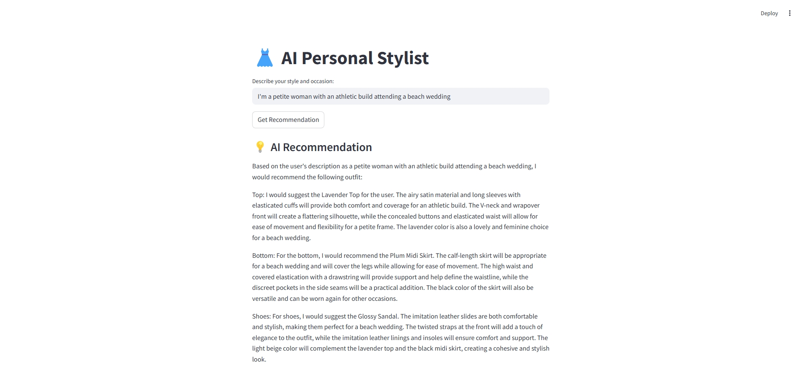
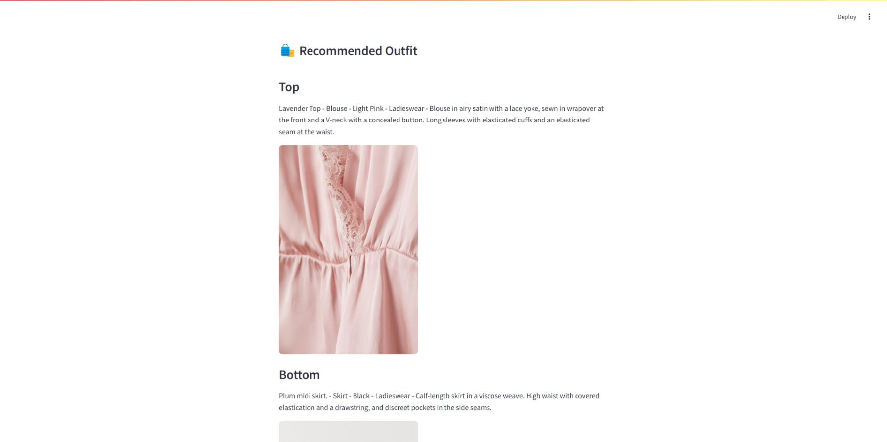
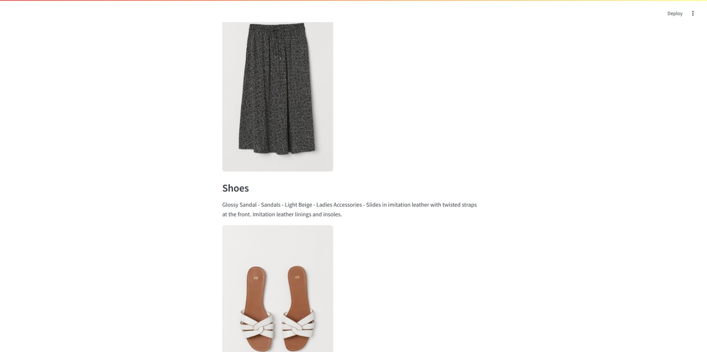

#  AI Outfit Recommender

This project is a lightweight **RAG-powered (Retrieval-Augmented Generation)** outfit recommendation system that combines user queries with a curated outfit database to generate stylist-approved suggestions. It leverages:

-  `mistralai/Mistral-7B-Instruct-v0.2` for natural language generation (quantized for memory efficiency)
-  `Qdrant` for storing and retrieving fashion item vectors
-  `LangChain` for prompt chaining and orchestration
-  `HuggingFace` models for both embeddings and LLM inference

---

##  How It Works

###  Step 1: Embedding and Vector Search
When a user provides a query like “I want something casual for a summer evening,” the system:

- Encodes the query using `sentence-transformers/all-MiniLM-L6-v2`
- Searches the `Qdrant` vector store for the most relevant outfit items (top, bottom, shoes)

###  Step 2: Prompt Assembly and LLM Inference
The retrieved items are formatted into a structured prompt like:

[INST] 
You are a fashion stylist. Based on the following items, select a top, bottom, and shoes that best suit the user.

User:
{question}

Available Items:
{context}

Explain your choices.
[/INST]

### Step 3: Output
The model returns:
- A natural-language rationale behind the outfit recommendation
- The retrieved clothing item details from the vector store

### Environment Variables
Make sure to set the following in your .env file:
HF_TOKEN=your_huggingface_token
QDRANT_URL=https://your-qdrant-instance
QDRANT_API_KEY=your_qdrant_api_key

## 🔍 Web App Preview

